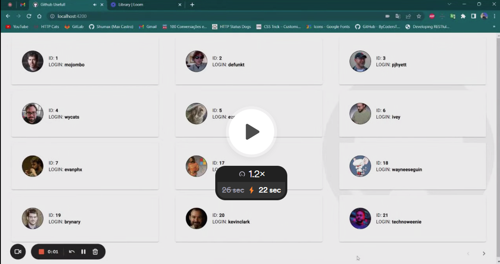

## Fullstack, Backend, Frontend - Challenge

#### Challenge resulution:

> This is a simple Full-Stack demo deployed using [JavaScript](https://developer.mozilla.org/en-US/docs/Learn/JavaScript/First_steps/What_is_JavaScript), [TypeScript](https://www.typescriptlang.org/), [HTML](https://developer.mozilla.org/en-US/docs/Web/HTML) and [SCSS](https://sass-lang.com/)

  - [Front End] in [Angular](https://angular.io/) with [Angular Material](https://material.angular.io/)
  - [Back End] in [Node.js](https://nodejs.org/en) with [Express](https://expressjs.com/)

#### Challenge instructions:

You must provide a link for your live app.

You have to create a **PRIVATE** repository for your code, use GitHub, it allows you to create private repositories.

When you finish the challenge, please share the GitHub app repository with **diego-shawandpartners**, and paste the repository URL on test description field at app.shawandpartners.com, so we will be able to check your code.

This test is applied for Full Stack, Back-End and Front-End developers, but some steps are exclusive for some roles. To set what steps must be implemented by each role, we use the following tags:

#### Requirements:

- \[FULL-STACK\]
  - If you applied for the full-stack role, you must implement this step
- \[BACK-END\]
  - If you applied for the back-end role, you must implement this step
- \[FRONT-END\]
  - If you applied for the front-end role, you must implement this step

#### Rules:

You can use any back-end language/framework, but NodeJS is very appreciated. For the front-end, you must use a framework (React, Angular, Vue, Preact, etc…) but React is very appreciated as well. However, if you are testing for the Ruby on Rails Engineer position, please use that language when writing your test.

If your project demands any custom configuration, you have to provide a README.md file with the instructions to execute your application.

For deploying, we recommend using a free service like [Render](https://render.com/).

#### On this test:

You will have to consume the GitHub APIs, more precisely the users and repositories endpoints, and create an application.

The endpoints' documentation that you will use for this test are available at:

- [https://developer.github.com/v3](https://developer.github.com/v3)
- [https://developer.github.com/v3/users](https://developer.github.com/v3/users)
- [https://developer.github.com/v3/repos/](https://developer.github.com/v3/repos/)

#### STEPS:

1.  \[full-stack\] \[back-end\]  
    Create an API that will proxy all client requests to the appropriate GitHub endpoint. The following endpoints must be provided:
    - GET - /api/users?since={number}  
      This endpoint must return a list of GitHub users and the link for the next page.
    - GET - /api/users/:username/details  
      This endpoint must return the details of a GitHub user
    - GET - /api/users/:username/repos  
      This endpoint must return a list with all user repositories
2.  \[full-stack (optional)\] \[back-end\]  
    Create tests for your application covering all endpoints.
3.  \[full-stack\] \[front-end\]  
    Create a screen that will list all users from GitHub and will display their ID and Login. Remember, you can’t list all users at once, you will have to use pagination.

    (if you are doing this test for the front-end role, you have to consume the GitHub endpoints directly)

    (if you are doing this test for the full stack role, you must consume the endpoints that you created at step 1)

4.  \[full-stack\] \[front-end\]  
    Using the screen created in step 3, create a new screen that will display the details of a user (ID, Login, Profile URL and the date of the login creation).
5.  \[full-stack\] \[front-end\]  
    On the details screen (created on step 4) add a table that will display the public repositories of the user, this table must contain the ID, name, and URL to the repository.

## Have fun!! 🙂
